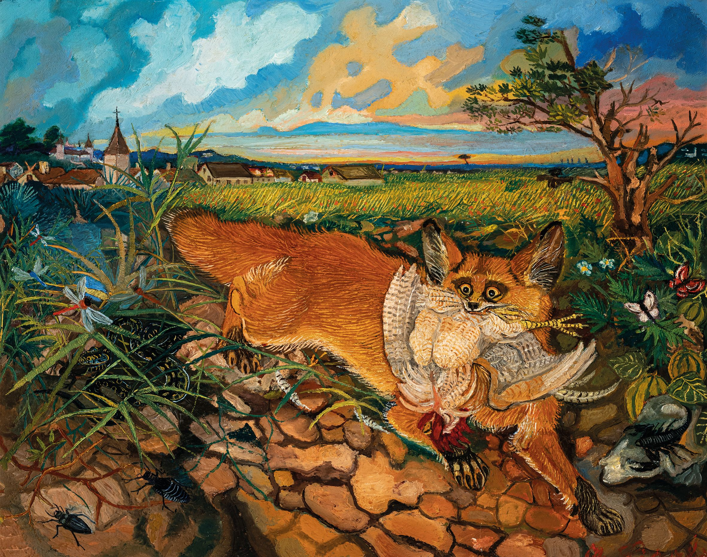

::: {.lang-switch}
🌐 [English](index.qmd) · [Italiano](index.it.qmd) · [Español](index.es.qmd) · [Português](index.pt.qmd) · **Français** · [Deutsch](index.de.qmd)
:::

::: {style="text-align:center;"}
{fig-align="center" width="350"}
:::

> And so an ecologist who begins by asking himself how life works very quickly finds himself asking instead why the natural ecosystems are made up of so many parts and why there are so many of each kind of part. Before he can answer an engineer's question "how does this work," he is faced with even more fundamental questions beginning with "why": Why are there so many different kinds of plants and animals? Why are some common but others rare? Why are some large but others small? Why do they sometimes do such peculiar things?
>
> Paul Colinvax, 1978. *Why big fierce animals are rare?* Princeton University Press.

### Qui suis-je ?

Eh bien, je suis écologue. Qu'est-ce qu'un écologue ? Un écologue est quelqu'un qui trouve de l'enthousiasme dans la beauté et la complexité de la nature. Je suis aussi un enseignant passionné et j'apprécie beaucoup les occasions d'enseigner et d'apprendre auprès de publics de tous niveaux d'expérience.

```{r}
#| echo: false
#| fig-width: 9
#| fig-height: 3.2
source("_timeline.R")
career_timeline("fr")
```

```{r}
#| include: false
# Prompt R
Sys.Date()
```

Créé par Leonardo Capitani ; Mis à jour le `r format(Sys.Date(), "%d %B %Y")`
