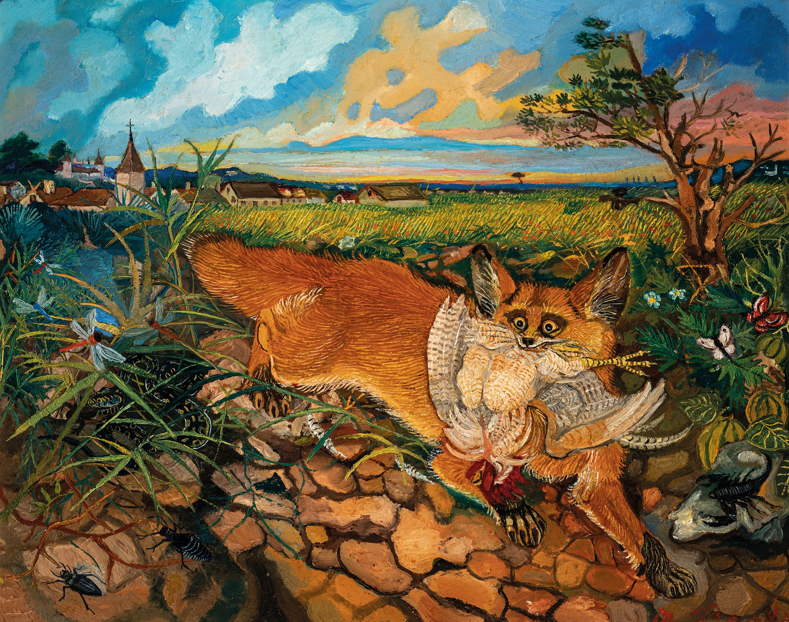

::: {style="text-align:center;"}
{fig-align="center" width="900"}
:::

> “Life itself is the most wonderful fairytale.”
>
> Hans Christian Andersen

### About

<div class="about-grid">
<div class="prose">
<p>I consider myself a hybrid professional, with a strong background in ecology and data analysis. I am a passionate educator and thoroughly enjoy chances to teach and learn with audiences of all levels of prior experience. And I like to see the glass as half full: a positive attitude is my key to living in this world.</p>
</div>
<div class="roles">
<h3>Now</h3>
<ul class="timeline">
<li class="now"><div class="t-role">Scientist, Aquatic Ecology</div><div class="t-where"><a href="https://www.eawag.ch/en/">EAWAG</a>, Switzerland</div></li>
</ul>
<h3>Previously</h3>
<ul class="timeline">
<li><div class="t-role">Postdoc</div><div class="t-where"><a href="https://www.wsl.ch/en/">WSL</a>, Switzerland</div><div class="t-proj">2023–2025</div></li>
<li><div class="t-role">Ph.D. Ecology</div><div class="t-where"><a href="https://posgraduacao.ufrn.br/4846/programa/apresentacao">UFRN</a>, Brazil</div><div class="t-proj">2017–2021</div></li>
<li><div class="t-role">Master in Ecology</div><div class="t-where"><a href="https://www.ufrgs.br/ppgecologia/">UFRGS</a>, Brazil</div><div class="t-proj">2015–2017</div></li>
<li><div class="t-role">Bachelor in Environmental Sciences</div><div class="t-where">University of Barcelona</div><div class="t-proj">2008–2014</div></li>
</ul>
</div>
</div>

```{r}
#| include: false
# Prompt R
Sys.Date()
```

Created by Leonardo Capitani; Updated `r format(Sys.Date(), "%d %B %Y")`
