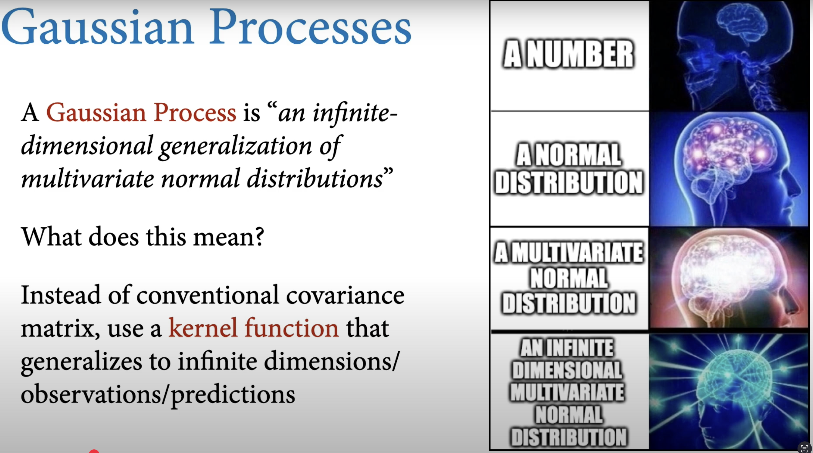

```{r load_libraries}
# Load required libraries
library(tidyverse)
library(here)
library(GPEDM)
library(kernlab)
library(numDeriv)
library(zoo)
library(mvtnorm)
```

## What is a Gaussian Process model?



From Richard McElreath [youtube presentation](https://www.youtube.com/watch?v=Y2ZLt4iOrXU&list=PLDcUM9US4XdPz-KxHM4XHt7uUVGWWVSus&index=16).

GP regression models rely primarily on the distance between input values rather than their magnitude, which has made them widely used in spatial statistics where they known as kriging. GPs have also gained popularity in machine learning due to their ability to provide fast predictions at new locations along with reliable uncertainty quantification (Rasmussen and Williams, 2005).

A GP model assumes that the response 𝑌 has a Multivariate Normal Distribution (MVN) centered at mean 𝜇𝑛, with covariance structure Σ𝑛. The covariance between two responses depends on distances between the corresponding inputs. Simply stated, if training points 𝑥 and 𝑥′ are closer together in the input space, the GP assumes responses 𝑦(𝑥) and 𝑦(𝑥′) are more highly correlated.

Pleae read this [notebook](Understanding Gaussian Process Models for Time Series Data) by Niamh Cahill. Fantastic !

::: callout-important
Niamh Cahill:

> The thing you always need to be aware of with modelling time dependent data is that observations measured over time are not independent.
>
> You need to consider something called auto-correlation (i.e., when the series of observations is correlated with itself in some way). The key to learning about Gaussian Processes is to understand the autocorrelation function.
:::

### Give me some maths, please:

I retrieve the maths text and description from Trent Henderson's blog post: [Interpretable time-series modelling using Gaussian processes](https://hendersontrent.github.io/posts/2024/05/gaussian-process-time-series/), Herb Susmann' notebook [Derivatives of a Gaussian Process](https://herbsusmann.com/2020/07/06/gaussian-process-derivatives/) and Brendan Hasz's [blog post](https://brendanhasz.github.io/2018/10/10/hmm-vs-gp.html) :

### Univariate Gaussian regression:

As you may recall the univariate gaussian regression is defined by (i) mean $\mu$ ; and (ii) variance $\sigma^2$ $$
\mathcal{N}(\mu, \sigma^2)
$$

### Multivariate Gaussian regression

Then we can increase the dimensionality of this univariate case to describe multivariate Gaussian regressions, by increasing the dimensionality of the parameters. This results in our mean becoming a mean vector $\mu$ and our variance becoming a covariance matrix $\boldsymbol{\Sigma}$ (as we now need to describe both the variance of each variable and the covariance between them), written as:

$$
\mathbf{X} \sim \mathcal{N}(\boldsymbol{\mu}, \boldsymbol{\Sigma})
$$

For example, we might jointly model plankton cell size, chlorophyll content, and plankton growth rate across lakes.

$$
\mathbf{X} =
\begin{bmatrix}
\text{Cell size} \\
\text{Chl content} \\
\text{Growth rate}
\end{bmatrix}
\sim \mathcal{N}(\boldsymbol{\mu}, \boldsymbol{\Sigma})
$$

$$
\boldsymbol{\mu} =
\begin{bmatrix}
15 \\
2.5 \\
0.8
\end{bmatrix},
\quad
\boldsymbol{\Sigma} =
\begin{bmatrix}
4 & 0.6 & -0.1 \\
0.6 & 0.2 & 0.05 \\
-0.1 & 0.05 & 0.01
\end{bmatrix}
$$

### Gaussian process regression:

A GP regression is just a generalisation of this idea to an infinite number of dimensions. This means our mean vector and covariance matrix become a mean function\* $m(x)$ and covariance function $k(x, x')$ (also called a ‘kernel’). The covariance function controls the smoothness of realizations from the Gaussian process and the degree of shrinkage towards the mean. Putting this all together, we have the general form of a GP:

$$
f(x) \sim \mathcal{GP}(m(x), k(x, x'))
$$

A popular choice for the covariance kernel function $k(x,x')$ is the [squared exponential kernel](https://www.cs.toronto.edu/~duvenaud/cookbook/) (a.k.a the Gaussian kernel or the radial basis function kernel).

For two data points which have $x$ values $x_i$ and $x_j$, the squared exponential kernel value between them is: $$k(x_i, x_j) = \alpha^2 \exp\left(-\frac{(x_i - x_j)^2}{2\ell^2}\right)$$

where $\alpha$ is the variance and $\ell$ is a length-scale parameter which controls the strength of the association between points as they become farther apart. Learning one length-scale per predictor variable is sometimes referred to as *‘automatic relevance determination’* (ARD), because ‘irrelevant’ predictor variables can be assigned a small length-scale, reducing their influence. **Recall that in the Empirical Dynamic Model (EDM) literature** [@munch2017] **and Tanya Rogers vignettes this length-scale** $\ell$ **parameter is called** $\phi$ **(phi).**

::: callout-note
**Question:**

But why should we use the GP regression within the EDM framework?
:::

Let us say we have an ecosystem consisting of $M$ different “state variables.” The state variables could represent the population density of $M$ different species, or the concentrations of $M$ different nutrients. They could also represent the density of just one species in $M$ different locations. More likely, the state variables represent some combination of population densities, nutrients, and abiotic factors in several different locations.

If we use $x_{1,t}, x_{2,t}, \dots, x_{M,t}$ to represent the value of all state variables at time $t$, then the vector

$$
\mathbf{x}_t = \{ x_{1,t}, x_{2,t}, \dots, x_{M,t} \}
$$

represents the state of the system. As the system changes through time, the result is a trajectory through this state space.

Apart from transients and random perturbations, the trajectory for most systems of interest will converge to an attractor, e.g., a point, a closed loop, or a more complex shape. We can describe the dynamics of the system in discrete time by a set of coupled equations. Since there are $M$ state variables, there are $M$ different “functions,” i.e., discrete-time models, each of which is a function of the current system state.

That is,

$$
x_{1,t+1} = F_1(\mathbf{x}_t), \quad
x_{2,t+1} = F_2(\mathbf{x}_t), \quad \dots
$$

If we have data on all of the state variables over a wide enough range of values, we can empirically estimate the functions $F_1(\mathbf{x}_t), F_2(\mathbf{x}_t), ...$ from the data.

And that is where the GP regression comes in:

::: callout-important
The $F_i(\mathbf{x}_t)$ function can be estimated using any number of flexible, non-parametric regression approaches such as the piecewise constant “Simplex” ([Sugihara and May 1990](https://cdnsciencepub.com/doi/10.1139/cjfas-2022-0219#core-collateral-refg61)), local weighted linear regression “S-Map” ([Sugihara 1994](https://cdnsciencepub.com/doi/10.1139/cjfas-2022-0219#core-collateral-refg60)), splines ([Ellner and Turchin 1995](https://cdnsciencepub.com/doi/10.1139/cjfas-2022-0219#core-collateral-refg19)) or the Gaussian Process regression [@munch2017].
:::

### Full GP-EDM model specification:

If we let $x_t$ represent the species abundance at time $t$ and consider it as a random function dependent on lag embeddings of itself (i.e., $x_{t-1}, \ldots, x_{t-m}$) for up to $m$ years, where $m$ represents the maximum number of time lags utilized.

That is, $x_t = f(x_{t-1}, \ldots, x_{t-m}) + \varepsilon_t$, where $f$ is a random function that approximates the dynamical process and $\varepsilon_t$ is the process error.

Then, we employ the GP regression prior to approximate the delay-embedding map $f$ [@munch2017]. The inputs, gathered in a vector $X_{t-m} = \{x_{t-1}, \ldots, x_{t-m}\}$, are incorporated into a Bayesian GP model formulated as follows (retrieved from [Tsai et al. 2024](https://academic.oup.com/icesjms/article/81/7/1209/7696789)):

$$
P(x_t \mid f, X_{t-m}, \phi, \tau, V_e) \sim \mathcal{N}\big(f(X_{t-m}), V_e\big),
$$

$$
P(f \mid \phi, \tau, V_e) \sim \mathcal{GP}(0, k(\cdot, \cdot))\quad \textcolor{red}{\text{(GP prior)}}
$$

$$
P(\phi) \sim \text{HalfNormal}\!\left(\pi \sqrt{\tfrac{1}{2}}\right),
$$

$$
P(\tau) \sim \text{Beta}(1.1, 1.1),
$$

$$
P(V_e) \sim \text{Beta}(1.1, 1.1).
\tag{1}
$$Where, the first layer represents the probability density of observing the species abundance at time $t$ given the function approximation $f$, the input data of time lags $X_{t-m}$, and the parameters $\phi$, $\tau$, and $V_e$, where $V_e$ represents the process noise. The second layer represents the probability density of the function approximation $f$ given the parameters. The unknown function $f$ is assigned a **Gaussian process prior** which generalizes the multivariate normal distribution with mean zero and covariance function $k(\cdot, \cdot)$.

The covariance function is a tensor product of squared exponential covariances for each input with pointwise variance $\tau^2$ and inverse length scales $\phi = \{\phi_1, \ldots, \phi_m\}$ where the index $i$ is from $1$ to $m$ (the maximum number of time lags). Specifically, the covariance function is

$$
k(X_t, X_s) = \tau^2 \prod_{i=1}^m \exp\big[-\phi_i (x_{t-i} - x_{s-i})^2\big],
$$

where $X_t$ and $X_s$ are delay coordinate vectors for years $t$ and $s$. The final layer of the Bayesian model specifies priors for the hyperparameters $\{\phi_1, \ldots, \phi_m, \tau, V_e\}$.

We encourage sparsity in the fitted model by assigning a half-normal prior with variance $\pi \sqrt{\tfrac{1}{2}}$ for $\phi_i$. This prior choice asserts that $f$ has, on average, one local extreme value within the data range, and the mode at zero encourages uninformative lags to drop out of the model (i.e. $\phi_i \to 0$). This prior is widely used in GP regression under the name *automatic relevance determination* (ARD). To further encourage sparsity, $\phi$ is determined as “zero” by rounding to the second decimal place. To improve the interpretability of the inverse length-scale parameter $\phi$, time series data are centered and standardized to unit variance prior to analyses.

Note that under this prior specification, the variance of a prediction at any input is $V_e + \tau^2$. Since the data are standardized to unit variance, $V_e + \tau^2 \approx 1$ should be sufficient. Nearly flat, independent Beta distributions are therefore used as priors for $V_e$ and $\tau^2$, allowing up to twice the variance in the data.

## Simulate GP regression in R

No more maths and words... now it is time to play and have fun! Let's code !

### Example 1

Let’s write this kernel function in R, and use it to draw samples from a GP. For simplicity, we will fix the mean function $m(x) = 0$ for all the GPs we work with in this exercise. First, define the kernel function:

```{r kernel_function}
# squared exponential kernel
kernel_function <- function(x_i, x_j, alpha, l) {
  alpha^2 * exp(-(x_i - x_j)^2 / (2 * l^2))
}
```

Let’s write a helper function that, given a kernel and a set of points, generates a full covariance matrix:

```{r covariance_from_kernel}

covariance_from_kernel <- function(x, kernel, ...) {
  outer(x, x, kernel, ...)
}
```

and a function to draw from a mean-zero GP with a given covariance kernel:

```{r gp_draw}
gp_draw <- function(draws, x, Sigma, ...) {
    # Create a mean vector 'mu' of all zeros, one for each input location in x
  mu <- rep(0, length(x))
  # Use mvtnorm::rmvnorm() to draw a number of random functions samples from a multivariate normal dist. with mean mu and covariance Sigma.
  mvtnorm::rmvnorm(draws, mu, Sigma)
}
```

Now we can draw 10 samples from a mean-zero GP with a squared-exponential kernel with parameters $\alpha = 1, \ell = 1)$:

```{r draw_samples}
set.seed(1) # reproducibility

n <- 100 # number of points to draw

x <- seq(1, 10, length.out = n) # position of each point

# Kernel parameters
alpha <- 1 # scale parameter
l <- 1 # lenght-scale parameter (phi)

# generate the covariance matrix
Sigma <- covariance_from_kernel(x, kernel_function, alpha = alpha, l = l) # remember that smoothness comes from the squared exponential kernel function we define previously

# Draw 10 random functions
draws <- gp_draw(10, x, Sigma)

# Convert to long dataframe for ggplot

df <- as.data.frame(t(draws))

df1 <- cbind(x, df)

df2 <- df1 |>  pivot_longer(cols = -x, # gather all draw columns
               names_to = "functions",
               values_to = "y")

# plot:
ggplot( data = df2 , aes( x = x , y = y , color = functions))+
  geom_line()+
  ylab("y = f(x)")+
  theme_bw(base_size = 14)

```

If we want to visualize the covariance matrix, here is a function to do that, and the plot for all hyperparameters set to 1:

```{r}

# generate the covariance matrix with hyperparameters = 1
Sigma <- covariance_from_kernel(x, kernel_function, alpha = 1, l = 1)
# generate the covariance matrix with lenght scake hyperparameters = .2
Sigma2 <- covariance_from_kernel(x, kernel_function, alpha = 1, l = 0.2)
```

```{r plot_covariance_matrix_function}
#' Code reetrived from :
#' https://hendersontrent.github.io/posts/2024/05/gaussian-process-time-series/
#' Convert covariance matrix to dataframe and plot
#' @param matrix the covariance matrix
#' @return object of class \code{ggplot}
#'

plot_covariance <- function(matrix){

  mat_df <- as.data.frame(matrix)
  mat_df$x <- seq_len(nrow(mat_df))

  mat_df <- reshape(mat_df,
                    direction = "long",
                    v.names = "values",
                    varying = 1:(ncol(mat_df) - 1),
                    times = 1:nrow(mat_df),
                    idvar = "x")

  p <- ggplot(data = mat_df) +
    geom_tile(aes(x = x, y = time, fill = values)) +
    labs(title = "Heatmap of covariance matrix",
         x = "x",
         y = "x",
         fill = "k(x,x')") +
    scale_fill_viridis_c(limits = c(0, 1),
                         breaks = seq(from = 0, to = 1, by = 0.2)) +
    theme_bw() +
    theme(legend.position = "bottom")

  return(p)
}
```

Covariance matrix with $\ell = 1$

```{r}
plot_covariance(matrix = Sigma)

```

Covariance matrix with $\ell = 0.2$

```{r}
plot_covariance(matrix = Sigma2)

```

### Example 2

```{r fake_data, message=FALSE, warning=FALSE}
# Simulate artificial ecological data: Rabbits (R) and Foxes (F)
# Let's assume fox population depends nonlinearly on rabbit population
set.seed(123)
n <- 100
R <- seq(1, 10, length.out = n)  # Rabbit population (independent variable)
F <- 5 * sin(0.3 * R) + sqrt(R) + rnorm(n, 0, 0.3)  # Fox population (response), with noise
data <- data.frame(R = R, F = F)
```

```{r fit_GP}
# Fit a Gaussian Process regression model
# Goal: Learn a smooth (possibly nonlinear) function: foxes (F) as a function of rabbits (R)
# This model assumes F is generated by a GP: F ~ GP(R)
# 'rbfdot' kernel allows modeling smooth, nonlinear relationships
gp_model <- gausspr(R, F,
                    data = data,
                    kernel = "rbfdot",   # Radial Basis Function (Gaussian) kernel
                    var = 0.01)          # Small noise term to allow slight deviation (smoothing)
```

```{r predict}
# Predict on a fine grid across rabbit populations
# This lets us see the model behavior across the full range of R
# We want smooth predictions (and derivatives) at many points
R_grid <- seq(min(R), max(R), length.out = 100)
preds <- predict(gp_model, data.frame(R = R_grid), type = "response")
```

To estimate the local interaction strength between species (e.g., how changes in rabbit population ( R ) affect fox population ( F )), we want to compute the partial derivative:

$\frac{\partial F}{\partial R}$

This derivative corresponds to a Jacobian element of the system at a given state ( R ).

Since the Gaussian Process (GP) model provides a **smooth function** ( F = f(R) ), we can use the **numerical gradient** to estimate this derivative at each point in a grid of rabbit values.

We first create a wrapper function around the GP prediction model:

```{r estimate_derivative}
# To estimate the derivative ∂F/∂R at each point:
# We must pass a *function* to grad() from numDeriv.
# So we create a wrapper around the GP prediction function.
gp_fun <- function(x) {
  predict(gp_model, data.frame(R = x), type = "response")
}

# Estimate the Jacobian (local sensitivity ∂F/∂R) using grad()
# grad() computes the numerical derivative of gp_fun at each R_grid point. In other words we apply grad() to each value of R_grid to compute the Jacobian (∂F/∂R)
# This gives us a time- or state-specific interaction strength
jacobian_estimates <- sapply(R_grid, function(r) grad(gp_fun, x = r))

head(jacobian_estimates)
```

Then we can visualize it:

```{r visualize}
# Visualization: GP fit and estimated interaction strength
par(mfrow = c(2, 1), mar = c(4, 4, 2, 1))

# Top panel: Observed vs. predicted fox population
plot(R, F, pch = 16, col = "gray", main = "GP Fit: Foxes (F) vs Rabbits (R)",
     ylab = "Foxes (F)", xlab = "Rabbits (R)")
lines(R_grid, preds, col = "blue", lwd = 2)

# Bottom panel: Estimated Jacobian (local interaction strength ∂F/∂R)
# Positive values: more rabbits → more foxes
# Negative values: more rabbits → fewer foxes (e.g. saturation)
plot(R_grid, jacobian_estimates, type = "l", col = "red", lwd = 2,
     main = "Estimated Local Interaction Strength (∂F/∂R)",
     ylab = "Gradient ∂F/∂R", xlab = "Rabbits (R)")
abline(h = 0, lty = 2)
```

### Examples from the web

-   Read this guy's blog: [Dr. Matthijs Hollanders](https://quantecol.com.au/blog.html). Why you should default to Gaussian processes for random spatial and temporal effects?

-   Motorcycle accident acceleration data ([link](https://users.aalto.fi/~ave/casestudies/Motorcycle/motorcycle_gpcourse.html))

-   Birthdays ([link](https://users.aalto.fi/~ave/casestudies/Birthdays/birthdays.html))

### Pros and Cons of GP-EDM

::: callout-note
**Benefits**

-   we can incorporate auxiliary biological and physical information through prior specification

-   we can incorporate a multilevel / hierarchical structure to share information across different locations (e.g. lakes).

**Cons**

GP-EDM becomes become noticeably slow with more than several hundred data points, and extremely slow with more than 1000.
:::

## The `GPEDM` package

I am going to reproduce Tanya Roger's vignettes (link [here](https://tanyalrogers.github.io/GPEDM/articles/extendedintro.html)).

### Mathematical foundation

The GP model fit by `GPEDM` is as described in [@munch2017]. This model uses a mean function of 0 and a squared exponential covariance function with one inverse length scale hyperparameter (*phi*, $\phi_i$) for each input $i$ (predictor). The values of $\phi_i$ tell you about the wiggliness of the function with respect to each input: a value of 0 indicates no relationship (the function is flat), low values of $\phi_i$ indicate a mostly linear relationship (the function is very stiff), and large values of $\phi_i$ indicate more nonlinear relationships (the function is more wiggly). The model, which is Bayesian, is as follows:

$$
\begin{aligned}
p[y_{t}|f,\mathbf{x}_{t},\theta]&\sim N(f(\mathbf{x}_t),V_\epsilon) \\
p[f|\theta]&\sim GP(0,\Sigma) \\
p[\theta]
\end{aligned}
$$ Where theta, ($\theta$) is the collection of hyperparameters $\{\phi_1...\phi_E, V_\epsilon, \sigma^2\}$, and the covariance function is defined by:

$$ \Sigma(\mathbf{x}_t,\mathbf{x}_s)=\sigma^2 {\exp[-\sum_{i=1}^{E}\phi_i(x_{it}-x_{is})^2]} $$

Therefore, for a given training data set, we want to find the optimal fit by using these three parameters:

-   $\phi$ : inverse length scale hyperparameter

-   $V$ ; process variance

-   $\sigma^2$ : pointwise prior variance

::: callout-important
## Two fitting methods

Two ways to fit a GP-EDM model:

-   **E/tau Method:** Supply a time series $y$ and values for $\tau$ (tau, time delay) and $E$ (number of lags to consider) . The model fitting function will construct lags internally ($E$ lags of $y$ with spacing $\tau$) and use those as predictors. This method is convenient, [but has some limitations]{.underline}. First, it assumes a fixed $\tau$, so you can't use unevenly spaced lags. Second, there are limited ways in which covariates can be incorporated.

-   **Custom Lags Method:** Construct the lags yourself externally, and supply the exact response variable and the exact collection of predictor variables to use. The model fitting function will use those directly. This allows for the most flexibility and customization, in that you can use any response variable and any collection of lag predictors from any number of variables.
:::

::: callout-note
## To remeber:

$\tau$ is the number of timesteps into the past that we are using for prediction. Considerations in choosing $\tau$ include:

-   **Forecasting needs** - over what time horizons are we trying to forecast? For example, if we have 10-minute data, probably a tau of 1 is not very useful because it would just be using data 10 minutes ago to predict data 10 minutes into the future. However, if we have daily data and we want a forecast for tomorrow, using a tau of 60 days might not be very useful because the model would only be using data that occurred two months ago to make a forecast of tomorrow (looking at more recent data would be beneficial).

-   **Autocorrelation in the data** - if we want to avoid just relying on autocorrelation for our predictive capacity, we might consider choosing a larger value of tau ($\tau$); one way to assess this is to visualize the ACF of the target variable and choose a tau that is approximately the minimum (or where ACF approaches 0 or levels off). Tau ($\tau$) should NOT be so incredibly sensitive that changing it from, e.g., 88 to 90 to 92 days should make a huge difference in model fit.
:::

To get a sense of what we have read, let's have fun with some simulated data !

### Fake data: 3-species chaotic Hastings-Powell model

The Hastings-Powell model is a mechanistic model describing a three-species food chain, consisting of a prey, a middle predator, and a top predator [@hastings1991]. It is known to exhibit chaotic dynamics under certain parameter values.

Let:

\- $x$ be the prey population,

\- $y$ be the middle predator population,

\- $z$ be the top predator population.

The system of differential equations is given by:

$$
\begin{aligned}
\frac{dx}{dt} &= x(1 - x) - \frac{a_1 x y}{1 + b_1 x} \\\\
\frac{dy}{dt} &= \frac{a_1 x y}{1 + b_1 x} - d_1 y - \frac{a_2 y z}{1 + b_2 y} \\\\
\frac{dz}{dt} &= \frac{a_2 y z}{1 + b_2 y} - d_2 z
\end{aligned}
$$

Where:

\- $a_1, a_2$ are the predation rates,

\- $b_1, b_2$ are the handling time coefficients,

\- $d_1, d_2$ are the natural death rates of the middle and top predators, respectively.

This model incorporates Holling Type II functional responses and can exhibit periodic or chaotic dynamics depending on the choice of parameters.

```{r}
# chaotic 3-species Hastings-Powell model
dplyr::glimpse(HastPow3sp)

n = nrow(HastPow3sp)

set.seed(1)
#  We will add a bit of observation noise to the data.
HastPow3sp$X <- HastPow3sp$X + rnorm(n,0,0.05)
HastPow3sp$Y=HastPow3sp$Y+rnorm(n,0,0.05)
HastPow3sp$Z=HastPow3sp$Z+rnorm(n,0,0.05)

par(mfrow=c(3,1), mar=c(4,4,1,1))
plot(X~Time, data = HastPow3sp, type="l")
plot(Y~Time, data = HastPow3sp, type="l")
plot(Z~Time, data = HastPow3sp, type="l")
```

### E/tau Method: fitting `GPEDM` model for a single time series

In this example, we split the original dataset (without lags) into a training and testing set, and fit a model with some arbitrary embedding parameters using the **E/tau Method**. For expediency we will put the test data in `fitGP` as well to generate predictions with one function call. You could omit it though.

```{r}
#E/tau Method with training/test split
HPtrain <- HastPow3sp[1:200,]
HPtest <- HastPow3sp[201:300,]
```

```{r fit_single_time_series}
gp_out1 <- fitGP(data = HPtrain,
                 time = "Time",
                 y = "X",
                 E = 3, # number of lags to be used: 3
                 tau = 2,# timely spaced by two lags , so we want to predict X by X-2, X-4 and X-6
                 newdata = HPtest)
```

The output of `fitGP` is a rather involved list object containing everything needed to make prediction from the model (much of which is for bookkeeping), but there are a few important outputs you may want to look at and extract. See [`help(fitGP)`](https://tanyalrogers.github.io/GPEDM/reference/fitGP.html) for more detail about the outputs.

The `summary` function quickly gives you the fitted values of the inverse length scales `phi` for each predictor, the variance terms, the $R^2$ value for the training data (`In-sample R-squared`), and the $R^2$ value for the test data (`Out-of-sample R-squared`) if test data were provided.

```{r}
summary(gp_out1)
```

Then we plot. Note that by default, `plot` will plot the out-of-sample predictions (for the test data, or the leave-one-out predictions if requested) if available.

```{r}
plot(gp_out1)
```

With ggplot:

```{r}

ggplot(gp_out1$insampresults, aes(x =  timestep,y = predmean)) +
  geom_line() +
  geom_ribbon(aes(ymin = predmean - predfsd, ymax = predmean + predfsd)) +
  geom_point(aes(y = obs), shape = 21) +
  theme_bw()
```

To see the in-sample fit, just do that

```{r}

head(gp_out1$insampresults, 10)
```

::: callout-note
You may note that the first `E*tau = 6` values are missing, which will happen when using the E/tau Method, since data prior to the start of the test dataset are unknown. [This can be prevented using the Custom Lags Method]{.underline}. This approach also allows you to change the forecast horizon by changing the lags used. For instance, if you wanted to use a forecast horizon of 3 with a `tau` of 2, you would change the lags to 3, 5, and 7.
:::

::: {.callout-caution appearance="minimal"}
### 1) Question for Tanya/Steve:

*"For instance, if you wanted to use a forecast horizon of 3 with a tau of 2, you would change the lags to 3, 5, and 7."*

May you give me an example, please? I am quite confused how it works...
:::

If you want to make predictions for another test data set, say the next 100 values, you can use `predict` rather than refit the model. The function `plot` will work on this output as well. The function `summary` will not, but you can access the fit statistics and predictions directly.

```{r}
HPtest2 <- HastPow3sp[301:400,]

pred1 <- predict(gp_out1, newdata = HPtest2)

pred1$outsampfitstats

plot(pred1)
```

### Custom Lags Method: fitting `GPEDM` model for a single time series

The `GPEDM` function for making lags is `makelags`, which makes lags $𝑦_{𝑡−𝜏},𝑦_{𝑡−2𝜏},...,𝑦_{𝑡−𝐸𝜏}$ . The lag is indicated after the underscore. If `append=T`, it will return `data` with the lags appended, otherwise just the lags.

```{r}
HastPow3sp_lags <- makelags(data = HastPow3sp, y = "X", E = 3, tau = 2, append = T)
head(HastPow3sp_lags, n = 10)
```

Then we split the data set:

```{r}
# Split data set
HPtrain_lags <- HastPow3sp_lags[1:200,]
HPtest_lags <- HastPow3sp_lags[201:300,]
```

Then we fit the `GPEDM` model:

```{r}
gp_out2a <- fitGP(data = HPtrain_lags,
                 time = "Time",
                 y = "X",
                 x = c("X_2", "X_4", "X_6"),
                 newdata = HPtest_lags)

summary(gp_out2a)
```

```{r}
plot(gp_out2a)
```

With ggplot:

```{r}
ggplot(gp_out2a$insampresults, aes(x = timestep, y = predmean)) +
  geom_line() +
  geom_ribbon(aes(ymin= predmean - predfsd, ymax = predmean + predfsd)) +
  geom_point(aes(y = obs), shape = 21 ) +
  theme_bw()
```

Now, if you want to check the predictions of the in-sample, just do the same as before:

```{r}
head(gp_out2a$insampresults, 10)
```

Otherwise, if you want to check the predictions of the out-of-sample, just do the same as before. Note that in this case you got the prediction of the first six test data observations!

```{r}
head(gp_out2a$outsampresults, 10)
```

::: callout-caution
### 2) Question for Tanya/Steve:

Why, in this case , do I get the first six out of sample predicted observations? Does the Custom lags method use the previous six observations from the training data set, with the lags I have defined by the `makelags`function? Is it correct my interpretation?
:::

## Multivariate models

Multiple predictor variables (and their lags) can be used in either `fitGP` by listing them under `x`. If you are using the same number of lags and the same `tau` for each variable, you can use the E/tau Method. If you want to mix and match predictors, you can use the Custom Lags Method and pick any combination. Since `fitGP` standardizes each input internally, and there are separate length scales for each input, data standardization is not as important as it is for other methods like Simplex and S-map.

```{r}
#Custom Lags Method with with leave one out, multivariate
HastPow3sp_lags_mv <- makelags(HastPow3sp, y = c("X", "Y", "Z"),
                               E = 2, tau = 1, append = TRUE)
colnames(HastPow3sp_lags_mv)
#> [1] "Time" "X"    "Y"    "Z"    "X_2"  "Y_2"  "Z_2"

HPtrain_lags_mv_train <- HastPow3sp_lags_mv[1:200,]

gp_out_mv2 <- fitGP(data = HPtrain_lags_mv_train, time = "Time",
                    y = "X", x = c(  "X_2" ,  "Y_2" , "Z_2" ),
                    predictmethod = "loo", exclradius = 6)

summary(gp_out_mv2)
```

::: callout-caution
### 3) Question for Tanya/Steve:

Why can't I fit the model by stating that `X` and `Y` are response variables ? e.g.: `y = c("X","Y")`

`Error in is.data.frame(x) : 'list' object cannot be coerced to type 'double'`
:::

Just to see the predictions:

```{r}

ggplot(gp_out_mv2$insampresults, aes(x = timestep, y = predmean)) +
  geom_line() +
  geom_ribbon(aes(ymin = predmean - predfsd, ymax = predmean + predfsd), alpha=0.4) +
  geom_point(aes(y = obs)) +
  theme_bw()+
  facet_wrap(pop ~., scales = "free")

```

## Hierarchical models (time series from multiple populations)

As an example, here are some simulated data from 2 populations (`PopA` and `PopB`) with theta logistic dynamics. This dynamics derive from a model that is an extension of the standard logistic growth model. It introduces a parameter (theta) that influences the shape of the growth curve and can account for different types of density dependence. The data that we are going to use contain some small lognormal process noise, and the populations have different theta values indicating distinct growth characteristics.

```{r}
str(thetalog2pop)
pA=subset(thetalog2pop,Population=="PopA")
pB=subset(thetalog2pop,Population=="PopB")

par(mfrow=c(1,2),mar=c(4,4,2,1))
plot(Abundance~Time,data=pA,type="l",main="PopA")
plot(Abundance~Time,data=pB,type="l",main="PopB")
```

When dealing with multiple populations, you have to think a little more carefully about whether you want to scale data across populations (`scaling = "global"`) or within populations (`scaling = "local"`). Since the data are on somewhat different scales and don’t necessarily represent the same ‘units’, we will use local scaling, as opposed to global. For a more detailed discussion of this, see the next lesson.

The model setup for a hierarchical model is the same as other models, you just need to add a `pop` column to indicate there are multiple populations. I am not including an exclusion radius for leave-one-out in this case, because the data are not autocorrelated.

```{r}
#E/tau method and leave-one-out, multiple populations
tlogtest=fitGP(data = thetalog2pop,
               time = "Time",
               y = "Abundance",
               pop = "Population",
               E = 3, tau = 1,
               scaling = "local",
               predictmethod = "loo",
               exclradius = 0)

summary(tlogtest)
```

From the summary, we can see that automatic relevance determination (ARD) approach has (perhaps unsurprisingly) deemed lags 2 and 3 to be unimportant ($\phi_i$ phi values are 0), so `E = 1` is probably sufficient. The fitted dynamic correlation (`rho = 0.32`) tells us that the dynamics are rather dissimilar. The within population and across population $R^2$ values are also displayed (these are normalized by either the within or across population variance).

Remember: The values of $\phi_i$ tell you about the wiggliness of the function with respect to each input: a value of 0 indicates no relationship (the function is flat), low values of $\phi_i$ indicate a mostly linear relationship (the function is very stiff), and large values of $\phi_i$ indicate more nonlinear relationships (the function is more wiggly)

::: callout-caution
### 4) Question for Tanya/Steve:

What are low and large in this case?

*low values of* $\phi$ indica*te a mostly linear relationship (the function is very stiff), and large values of* $\phi$ *indicate more nonlinear relationships.*
:::

For more information on fitting hierarchical models, including the use of pairwise dynamic correlations with \>2 populations, see [this vignette](https://tanyalrogers.github.io/GPEDM/articles/hierarchical.html).

::: callout-note
## 5) Question for Tanya/Steve:

Would be possible to use a continuous variable as level, such as lake volume ? So instead of using `pop` categorical column use `volume` continuous column. I feel this is what the GP regression is made for ... but I am not quite sure how to fit it within the `GPEDM` package.
:::

## Visualizing conditional effects (the kernel function)

One thing you might be wondering is how we can visualize the shape of our fitted function 𝑓. If 𝑓 is 1- or 2-dimensional, we can create a grid of input values, pass them as `newdata`, and plot the resulting line or surface. If the function is more than 2 dimensional, this gets tricky, but we can look at slices of 𝑓 with respect to certain predictors, holding the values of the other predictors constant. The function `getconditionals` is a wrapper that will compute and plot conditional responses to each input variable with all other input variables set to their mean value. Although it does not show interactions, it can be useful for visualizing the effects of the predictors. Can also be used to check that your function isn’t doing something nonsensical and inconsistent with biology. To create 2-d conditionals surfaces, or to look at conditional responses with other predictors fixed to values other than their mean, you can pass an appropriately constructed grid to `newdata`. Visualizing models this way makes it possible to think about EDM from a more ‘mechanistic’ functional viewpoint.

```{r}
#From the multivariate Hastings-Powell simulation
getconditionals(gp_out_mv2)
```

```{r}
#From the 2 population theta logistic
getconditionals(tlogtest)
```

## Species interactions strengths

From [@yukihira2025]:

::: callout-important
When inferring the Jacobian elements from time series, GP-EDM approach has three advantages over S-map methods.

1.  GP-EDM can flexibly control the nonlinearity of each state variable by the automatic relevance determination (ARD) approach. This is in contrast to S-map algorithms, which assume uniform nonlinearity over all state variables. **This improves the identifiability of the effects of each species with the GP-EDM inference**.
2.  GP-EDM explicitly incorporates the uncertainty of Jacobian elements into the model structure as well as process noise. In S-map, process noise degrades the estimation of the nonlinearity parameter of the kernel function (i.e. $\theta$) by confusing it with the Jacobian uncertainty. **Thus, GP-EDM may outperform S-map and regularized S-map in the presence of process noise.**
3.  unlike S-map methods, GP-EDM can reconstruct the local shape of the nonlinear map around each data point. This means that GP-EDM recovers Jacobian elements even when the focal dynamics are highly nonlinear.
:::

T. Rogers: Just as with S-map, it is possible to obtain local slope coefficients from a GP model. The partial derivatives of the fitted GP function at each time point with respect to each input can be obtained from the `predict` function, setting `returnGPgrad = T`. They will be under `model$GPgrad`. The gradient will be computed for each out-of-sample prediction point requested (using methods `"loo"`, `"lto"`, or `newdata`). If you want the in-sample gradient, pass the original (training) data back in as `newdata`.

```{r}
#From the multivariate Hastings-Powell simulation
grad1 <-  predict(gp_out_mv2, predictmethod = "loo", exclradius = 6, returnGPgrad = T)

str(grad1$GPgrad)

gradplot <-  cbind(HPtrain_lags_mv_train, grad1$GPgrad)

par(mfrow=c(3,1),mar = c(4,4,2,1))

plot(d_X_2~  Time, data = gradplot, type="l")
plot(d_Y_2 ~  Time, data = gradplot, type="l")
plot(d_Z_2 ~ Time, data = gradplot, type="l")
```

::: callout-important
### 6) Question for Tanya/Steve:

May you comment on this function:

`getGPgrad = function(phi, Xnew, X, Cdi, iKVs, Y) {`

`grad = t(-2 * t(t(Xnew-t(X)) %% diag(phi)) %% (t(Cdi) * iKVs %*% Y)) }`

What does this function do? I am interested to understand it because using this function we can extract the posterior of the partial GP derivatives (S-map Jacobian elements , a.k.a species interactions strengths). Can we have the full posterior with mean, and 95% CI ?
:::

## Some expectations/ hypothesis

Let's generate some simulate data and plot them .

::: callout-note
**Question:**

To what extent does invasive species presence/abundance influence plankton emergent properties?
:::

```{r define _GP_function}

get_GP_simulation <-
  function(x = seq(0,10, by = 0.1),
           Intercept = 0,
           slope = 1,
           sigma = 1,
           sigma_f = 0.5,
           lambda = 100,
           seed = NULL) {

    if (! is.null(seed)){
      set.seed(seed)
    }

    # number of points to generate prediction for
    N <- length(x)

    # linear predictor (vanilla LM)
    eta = Intercept + slope * x

    # kernel function (here: radial basis function kernel)
    get_covmatrix <- function(x, sigma_f, lambda) {
      K = matrix(0, nrow=N, ncol=N)
      for (i in 1:N) {
        for (j in 1:N) {
          K[i,j] = sigma_f^2 * exp(sqrt((i-j)^2) / (-2 *lambda))
        }
      }
      return(K)
    }

    # covariance matrix
    K <- get_covmatrix(x, sigma_f, lambda)

    # Gaussian process wiggles
    epsilon_gp <- mvtnorm::rmvnorm(
      n     = 1,
      mean  = rep(0, N),
      sigma = K)[1,]

    # central tendency
    mu <- epsilon_gp + eta

    # data prediction
    y <- rnorm(N, mu, sigma)

    tibble(x, eta, mu, y)
  }
```

Then plot:

```{r plot_gp}
# simulate
sim <- get_GP_simulation(
  x = seq(-1 , 1, length.out = 500),
  Intercept = 0,
  slope = 0.3,
  sigma_f = 0.5,
  lambda  = 20,
  sigma = 0.05)

# then plot
ggplot(sim, aes(x = x, y = eta )) +
    #geom_line(color = project_colors[1], size = 1.25) +
    geom_line(aes(y = mu), color = "black", linewidth = 0.85) +
    geom_point(aes(y = y), color = "darkgrey", shape = 21, size = 1.5)+
  theme_bw(base_size = 14)+
  scale_y_continuous(
    name = "Connectance (%)",  # axis title
    labels = function(breaks) {
      # Map the default breaks linearly to a new range, e.g., 10 to 70
      scales::rescale(breaks, to = c(10, 70))
    })

```

## S-Map: definition:

What is an S-map: it is a sequentially computed Jacobian coefficients. The S-map forecasts an ecological variable from a given historical or control time series. The S-map uses training data to describe a dynamical attractor (i.e., state-space reconstruction, SSR) which is then used to form a prediction from a point in state space.

## MDR S-Map: multiview distance regularised algorithm

Preliminary information:

1.  What is an S-Map: it is a local linear fit with state-space dependent kernel function.

2.  The regularized S-Map algorithm was presented by [Cenci et al 2019 Meth Eco. Evo](https://besjournals.onlinelibrary.wiley.com/doi/epdf/10.1111/2041-210X.13150) to reduce the S-Map sensitiveness to process noise.

3.  You should know that when you use the regularized S-Map algorithm, the **regularization scheme** and the **structure of the kernel function** MATTER a lot [@cenci2019]. You shoul use different regularization and/or kernel functions for whether inference or forecasting is the ultimate goal of your research study.

4.  But the classical regularized S-­map algorithm allows a limited number of variables (or network nodes) being embedded into the model [@deyle2016; @ushio2018].

5.  And this restriction arises due to the “curse of dimensionality” [@munch_recent_2023] (Bellman, 1957).

6.  Curse of dimensionality: In fact if we increase the number of predictors then we need "a lot" of data to reconstruct the "true" attractor.

7.  More precisely, the number of possible attractor reconstructions grows combinatorially with the number of variables we use [@ye2016a]. For example, the number of distinct three-­dimensional combinations (three-­dimensional embeddings) for a system with up to 3 lags of 10 variables is nearly 3000. Imagine: ¡ Three thousand attractors with equivalent, or near equivalent fits !!!!

8.  Therefore [Chang et al. 2021](https://doi.org/10.1111%2Fele.13897) proposed the new algorithm called *multiview distance regularised S-map* (MDR S-map) that quantifies the neighbouring relationships among high-dimensional data points in the attractor reconstruction.

9.  The MDR S-map algorithm is no more than the sum of two steps:

    1\) measuring multiview distances among *m*-dimensional data from various E-dimensional multiview attractors that embeds various combinations of variables [@ye2016] and 2) determining *m*-dimensional interaction jacobian matrix at each time point by plugging-in the multiview distances to the S-map algorithm with regularization constraints [@cenci2019]. *m* = number of nodes @fig-mdrsmap.

    {#fig-mdrsmap}

    Please note that SSR is synonim of attractor. The aim of the first step is to obtain the multiview distance that operates at the optimal embedding dimension ($E$), which is much smaller than the dimensionality of large interaction networks ($m$, the number of nodes). Under the curse of dimensionality, neighbourhood relationships among data points cannot be precisely inferred from the distance $d_M(\cdot)$ among high-dimensional data points in manifold $M_x$ that summarises the dynamics of entire interaction networks. Therefore, (1–1 @fig-mdrsmap) we recovered the neighbourhood relationships among high-dimensional data points $X(t)$ from numerous low-dimensional state space reconstructions (SSR; $M_1, M_2, \ldots, M_C$), that is, multiview SSR. Among these SSRs, (1–2) we computed distances (L2 norm, i.e., Euclidean distance) between data points under the optimal embedding dimension $E$. Collecting all these distances, (1–3) we obtained the multiview distances ($d_E$) and (1–4) determined the data weights ($W_E$) for the following S-map analysis. In the second step, we estimated the high-dimensional interaction strength ($B$) by S-map, based on locally weighted least-square optimisation $\arg\min_B (|\cdot|_2)^2$ with regularisation $\lambda[\cdot]$ incorporated. Specifically, (2–1) the weights $w_E = \exp(-\theta d_E / \mathrm{mean}(d_E))$, derived in the first step, were plugged into the S-map optimisation algorithm. (2–2) Under the constraint of regularisation ($\lambda$ and $\alpha$ are the penalty factors of regularisation), (2–3) we solved the high-dimensional local linear coefficients to approximate interaction strengths at each time step.

### Course of dimensionality

::: callout-note
**Question:** How GP-EDM deals and solve the issue raised by the *curse of dimensionality* [@ye2016a]? That is: if we set the Embedding dimension to 15 (E = 15 plankton guilds, tau = 1 month lag), how the GP-EDM leverage the multiplicity of possible attractor reconstructions to improve prediction?

By reading your great [Choosing Embedding Parameters vignette](https://tanyalrogers.github.io/GPEDM/articles/choosingE.html), am I correct if I say that when we use GP-EDM, is the automatic relevance determination’ (ARD) procedure that works in a similar way as the Multiview Distance Regularisation MDR S-Map (Ye & Sugihara 2016, Cenci et al 2019 and Chang et al 2021)? That is, ARD drops predictors / lags that are uninformative.  Is there something else that GP-EDM does in this sense?
:::

::: callout-important
**Munch's Answer:**

The 'automatic relevance determiniation' in GP-EDM will drop unimportant inputs. It generally works pretty well when there aren't too many inputs and they aren't too highly correlated.

But it does not resolve the identifiability problem that occurs in multivariate time series where many collections of variables provide equivalent embeddings.

E.g. say we have 10 variables x1, x2,..x10 and the subsets (x1, x2,x3) and (x4,x5,x6) are equivalent in terms of embedding the attractor. What this means is that there is a function of (x1,x2,x3) that provides perfect predictions for x1...x10 and a whole other function of x4, x5,x6 that does so as well. They might stretch or shrink different parts of the attractor in different ways, resulting in local differences in prediction accuracy. But overall they should be indistinguishable.

If we try to make a GP using x1 through x6 as inputs, it is tough to say what ARD will pick out. It might pick 1-3, it might pick 4-6 and it might try to keep everybody. In my experience, all of these can occur due to small variations in the data. I think this represents a fundamental limitation of 'variable selection' in the context of nonlinear time series rather than a problem with GP per se.  At this point, it seems like it might be worthwhile to update the GP kernel with something like 'multiview distance', but we haven't done that yet.
:::

::: callout-important
**Tanya Rogers's answer:** Yes, you can definitely end up with different representations that perform equivalently, which is not as much of an issue if all you care about is prediction, though if given several models of equal performance, I will try and pick the one that seems the most biologically reasonable based on prior knowledge. For inference though, and finding the most 'meaningful' representation, it gets trickier, and any modeling method is going to struggle with it.
:::

## Benchmarking time series forecasting model

From <https://stats.stackexchange.com/questions/163164/benchmarking-time-series-forecasting-model>:

> Problem: I'm building a time series forecasting model for daily data wherein, the aim is to forecast for the next one week. So, to validate the model, I'm using a moving window based validation wherein, I take 8 weeks (56 days) of data and forecast for the next one week (7 days) and then I move the window by 7 days till the end of series. With the actual and forecasted values, I'm able to measure the accuracy of forecast.
>
> Ask: Now I want to perform a benchmarking of the model with something very simple like moving average over multiple windows (30, 45, 60) day windows. Is this kind of benchmarking statistically correct ? What is the correct way to benchmark a timeseries forecasting model with something simple like moving average ?

You are doing exactly the right thing:

-   using a holdout sample (never compare accuracies in-sample!)

-   comparing your forecasts to a simple model

Indeed, [it's quite common for a very simple model to outperform more complex ones in forecasting](https://stats.stackexchange.com/q/124955/1352), and **you should always benchmark against simple methods**. [Here are some more suggestions for simple benchmarks.](https://www.otexts.org/fpp/2/3) I'd especially recommend:

-   the historical mean value

-   the naive no-change forecast (forecast the very last observation out)

-   the seasonal naive forecast (to forecast for next Tuesday, use the last Tuesday observation - this models intra-week seasonality in a simple way)

Your moving window approach also makes sense. Keep the length of history in mind - it may be that some methods work better with shorter histories, others with longer ones.

## Impute missing values with EDM

By default, `fitGP` excludes any rows that contain missing values (NAs) in either the response or predictor variables. Thus, in a delay embedding model, a missing datapoint in the middle of a time series will be excluded as will the following `E` values (assuming `tau` is 1). Stephan Munch and Bethany Johnson developed a method whereby using the time spacing between a value and its lagged predictors as another predictor, we can exclude less data, generate predictions for all non-missing timepoints, and by adjusting the spacing in the forecast matrix, generate forecasts multiple timesteps into the future. [Johnson and Munch (2022)](https://www.sciencedirect.com/science/article/abs/pii/S0304380022000680) contains more details. The method is called variable step-size: VS-EDM [@johnson2022].

### How to use the VS-EDM:

First, let's generate a time series with NAs using the prey population time series of the caotic 3 species Hasting-Powell model:

```{r generate_NAs}
data(HastPow3sp)

#add some missing values for variable X
set.seed(20) #for the sake of reproducibility

# just select time series of species X, prey population dynamics
HPmiss = HastPow3sp[,c("Time","X")]

# add missing values: randomly chooses 100 rows of the 501 we have and we introduce missing values (NA) for those rows
HPmiss[sample(1:nrow(HPmiss),100),"X"] = NA

# plot
ggplot(HPmiss, aes(x = Time, y = X)) +
  geom_line() +
  geom_point() +
  theme_bw()
```

Using VS-EDM method requires that lag predictors be generated beforehand (option 1 in [Specifying training data](https://tanyalrogers.github.io/GPEDM/index.html#specifying-training-data)). The `makelags` function has an option for the variable timestep method (`vtimestep=TRUE`) that will generate the time difference lags automatically. **Including the `time` argument is strongly recommended, and you definitely need to include it if the rows with missing values have already been removed and/or the timesteps are uneven.** When using the variable timestep method, it is necessary to differentiate between the response variable and covariates, as they are handled differently. The response variable should go under `y` and the covariates should go under `x`. The output matrix will include lags of Tdiff (time difference). Argument `Tdiff_max` can be used to set the max time difference value considered (e.g. if you have one large time gap that you don’t want to use this method for).

Apply the `makelags` function with the `vtimestep` method:

```{r}
# remember that:
# E :  number of lags that you want to used: if E = 3 then, you will use three lags,
# tau = 2,# timely spaced by two lags , so we want to predict X by: X-2, X-4 and X-6

# variable step method
HPmisslags = makelags(data= HPmiss, y = "X",
                      time = "Time",
                      E = 2,
                      tau = 1,
                      vtimestep = T)

head(HPmisslags, 15)
```

Bind the two dataframes: response variable with NAs and the predictors with lags:

```{r bindingdataframes}

HPmissdata = cbind(HPmiss, HPmisslags)
```

## Zurich lake example

I am going to use the dataset from [@merz_disruption_2023]. These are monthly time-series from Lake Zurich (Switzerland) of 13 plankton functional groups, phosphate concentration, and water temperature from January, 1978 to December, 2019.

This dataset was used by [@medeiros2025] and I add here figure S19 , from their Supplementary materials:

![Relationship between future (x(t+ 1)) and current (x(t)) abundance inferred from the GP-EDM model for different levels of phosphate concentration (different colors) for large green algae in Lake Zurich. **A:** Predicted bifurcation diagrams (in red) using the GP-EDM model trained up to each of the four dashed lines. Bifurcation diagrams depict the population abundance after the transient period (y-axis) for a range of phosphate concentration val- ues (x-axis). The training data end points are shown as dates above each plot. Gray points denote population abundance values used to train the GP-EDM model (dark gray) or not yet observed (light gray). **B:** Each plot shows the inferred relationship between x(t+ 1) and x(t) using the training data set specified in the plots in A. Note that other model inputs are also important for function x(t+ 1) = G\[x(t),x(t−1),x(t−2),x(t−3),w(t),w(t− 1),p(t)\], but are held constant here for simplicity. These plots suggest that the relationship between x(t+ 1) and x(t) becomes more nonlinear at higher phosphate concentrations, resulting in chaotic regimes with large-amplitude abundance fluctuations.](images/figS19.png){fig-align="center"}

## References
