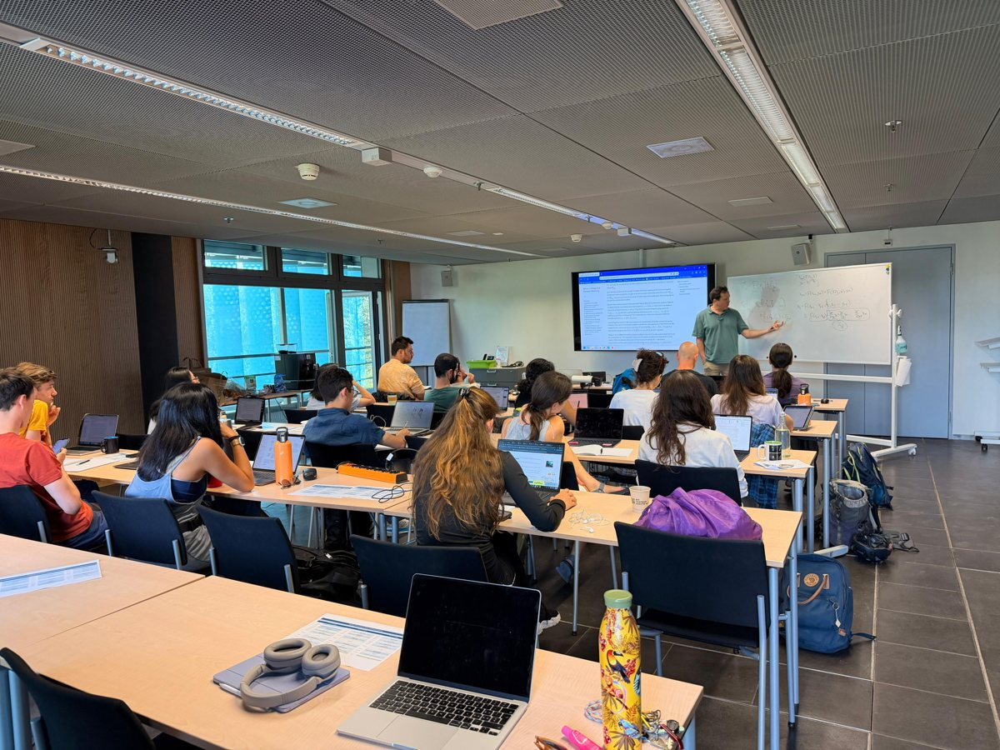
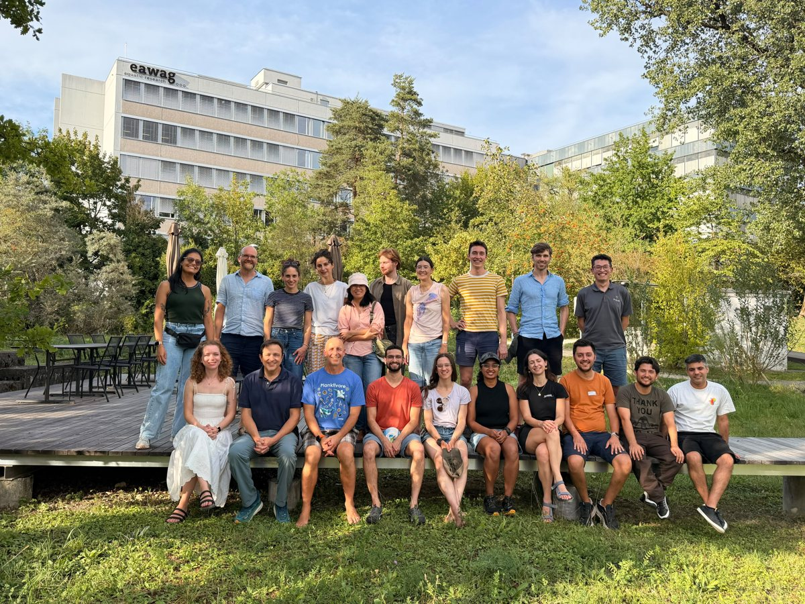

### Talks, presentations and workshops

Talks I have given and workshops I have organised during my academic career, most recent first. Slides are shared openly whenever I am free to do so.

------------------------------------------------------------------------

#### 25–27 August 2026 — *Advanced time series analysis using empirical dynamic modelling (EDM)*

Eawag, Dübendorf, Switzerland. A three-day workshop I co-organised, bringing together participants interested in detecting causal relationships between variables without assuming a fixed model structure, and in forecasting how populations, communities and interactions respond to change over time. Participants were expected to arrive with a basic familiarity with dynamical systems, nonparametric regression, multivariable calculus and linear algebra.

Dr. [Steve Munch](https://www.fisheries.noaa.gov/contact/stephan-munch) and Dr. [Tanya Rogers](https://www.fisheries.noaa.gov/contact/tanya-rogers-phd) (NOAA Fisheries and University of California, Santa Cruz) were invited to give the workshop.

Organised jointly by the [Pomati lab](https://www.eawag.ch/en/about-us/portrait/organisation/staff/profile/francesco-pomati/show/) and the Machine Learning & Complex Systems group of [Marco Baity-Jesi](https://www.eawag.ch/en/about-us/portrait/organisation/staff/profile/marco-baity-jesi/show/) at Eawag, with the support and funding of the [Biodiversity Center WSL–Eawag](https://biodiversitycenter.wsl.ch/en/?show=13).

If you are interested in the course materials, please [send me an email](contact.qmd) and I would be happy to share them under personal agreement.

::: {layout-ncol="2"}
{fig-alt="Participants at the EDM workshop following a lecture at Eawag"}

{fig-alt="Group photograph of the EDM workshop participants outside the Eawag building"}
:::

------------------------------------------------------------------------

#### 25 June 2025 — *Microbial plankton uptake enhances the degradation of a biodegradable microplastic*

Flash talk, Department of Aquatic Ecology, Eawag, Switzerland. Main results on how marine microbial plankton interact with PLGA (poly lactic-co-glycolic acid), a biodegradable microplastic: to what extent and in which size ranges ciliate and nanoflagellate communities take the particles up, and whether their grazing accelerates the polymer's degradation in seawater. Work carried out under the [AQUACOSM-plus](https://www.aquacosm.eu/) umbrella, in collaboration with Dr. Luca Schenone and [Ulises Lora](https://emm.icm.csic.es/ulises-lora/).

Published as [Schenone et al. 2025](https://doi.org/10.1016/j.envpol.2025.126252), *Microbial plankton uptake enhances the degradation of a biodegradable microplastic* (Environmental Pollution) — code and data on [Zenodo](https://zenodo.org/records/14186093).

[ Download the slides (PDF)](slides/2025-06_ecology-department_flash-talk_plga_plankton.pdf)

------------------------------------------------------------------------

#### 14 March 2024 — *Beavers influence stream dissolved organic carbon by coupling terrestrial–aquatic ecosystems*

[13th Workshop on Floodplain Ecology](https://www.wsl.ch/en/events-and-courses/auenoekologischer-workshop-1-1/), Swiss Federal Institute for Forest, Snow and Landscape Research (WSL), Switzerland. Talk on whether beaver ponds act as a source or a sink of dissolved organic carbon in Swiss streams, based on 16 sites sampled in 2021–2022. I present the causal hypothesis as a directed acyclic graph, the upstream–downstream sampling design behind the delta-DOC outcome, and the roles of aquatic primary production, terrestrial inputs, and pond age.

[ Download the slides (PDF)](slides/2024-03_wsl_floodplain_workshop_beavers_doc.pdf)

------------------------------------------------------------------------

#### December 2022 — *Aquecimento do mar e o Atol das Rocas*

Universidade Federal do Rio Grande do Norte (UFRN), Brazil. Guest lecture on how ocean warming and marine heatwaves affect the food web of the Rocas Atoll, covering the thermal niches of the species involved, the long-term monitoring behind the work (PELD ILOC), and the modelling results and methods.

*The presentation is in Portuguese.*

[ Download the slides (PDF)](slides/2022-12_ufrn_aquecimento_atol_das_rocas.pdf)
