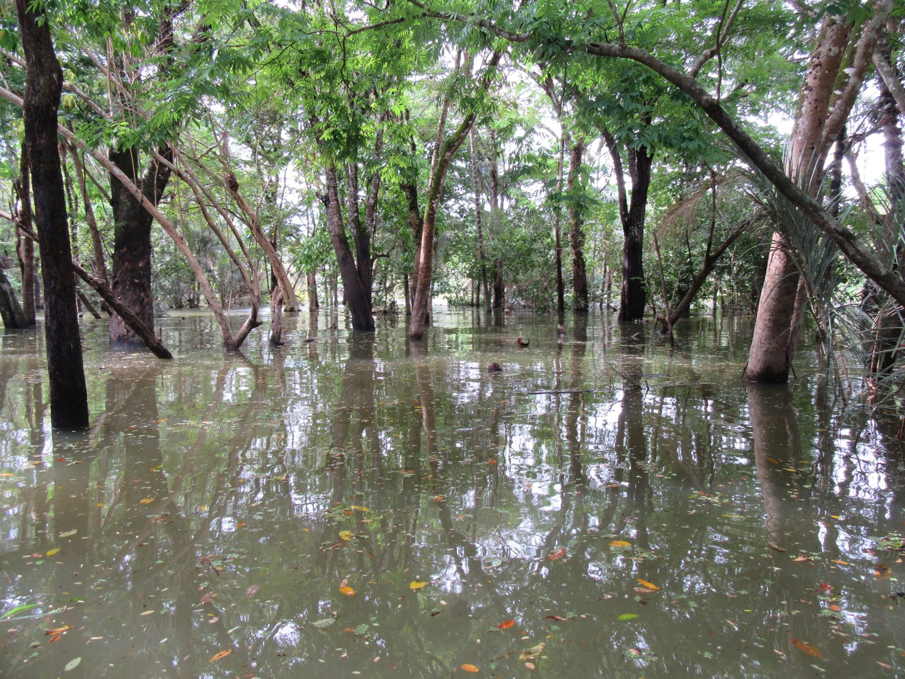
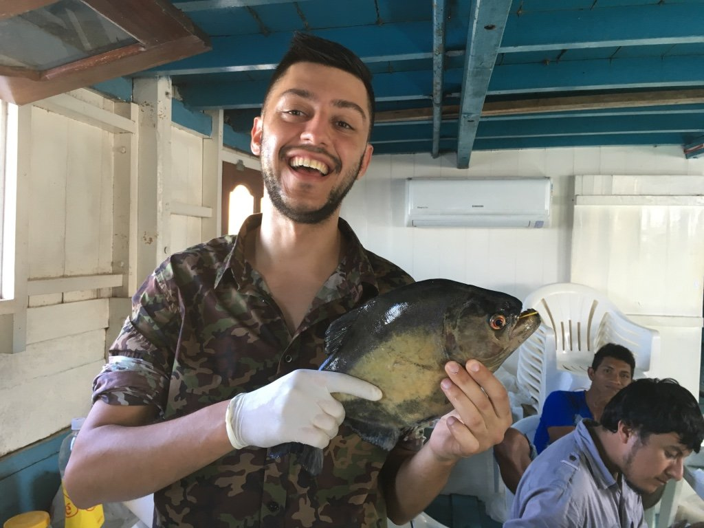
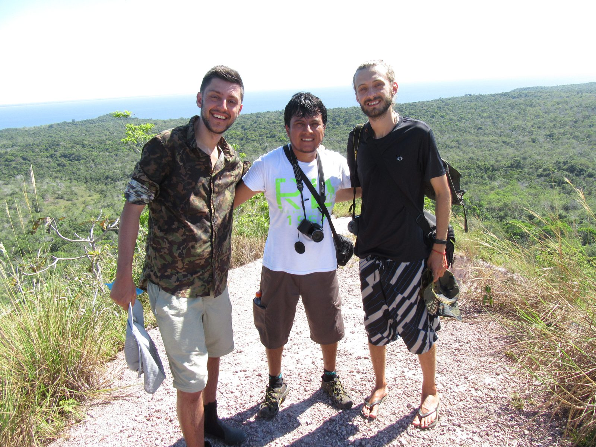
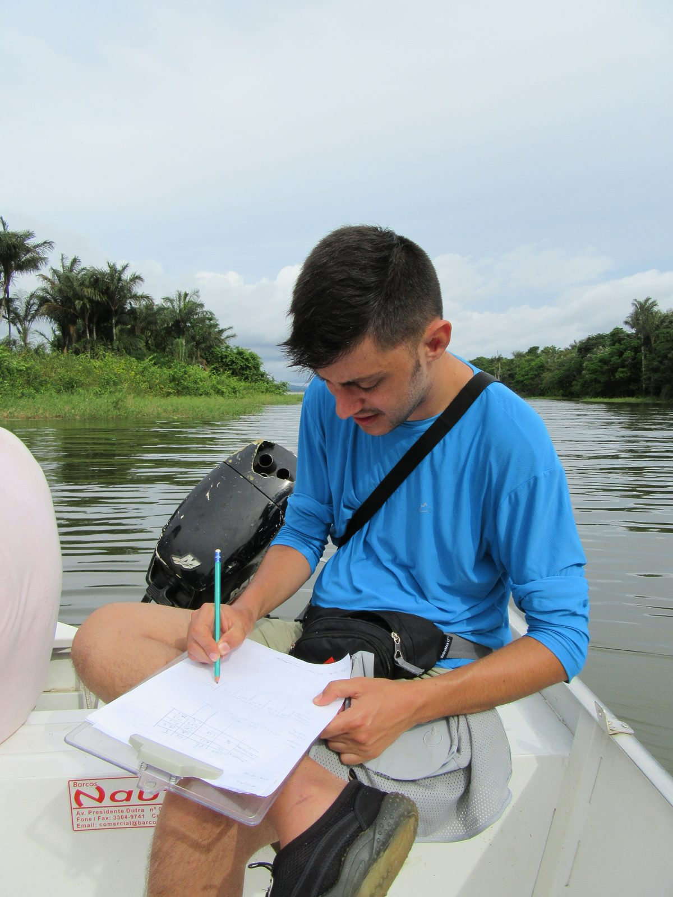
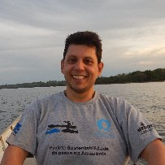

::: {#heading}
This was my Master's research project in Ecology at the [Universidade Federal do Rio Grande do Sul (UFRGS)](https://www.ufrgs.br/), Brazil, carried out at the **Laboratório de Ecologia Humana e Etnoecologia ([LEHPE](https://www.ufrgs.br/etnoecologia/))** under the supervision of Prof. Dr. [Renato A. M. Silvano](https://scholar.google.com/citations?user=e_RmXEsAAAAJ&hl=pt-BR) and Prof. Dr. Ronaldo Angelini.
:::

## Project description

Large Amazonian rivers sustain some of the most productive inland small-scale fisheries in the world, but they are increasingly pressured by deforestation of their catchments and by rising fishing effort. My Master's project used **ecosystem food-web modeling** (Ecopath with Ecosim) of the **Tapajós River**, combining fishers' ecological knowledge and field data, to anticipate how these two drivers may reshape the river's food web and the fisheries that depend on it.

, reproduced here by the first author.](images/tapajos_study_area_map.png){fig-align="center" width="80%"}

Much of the fieldwork happens in the **várzea**, the seasonally flooded forest along the river. When the water rises, fish move into the trees to feed — which is precisely why a food web here cannot be understood from the open channel alone.

{fig-align="center" width="85%"}

Building the food web starts with knowing who is in it, so a large part of the fieldwork is simply registering the ichthyofauna of the river — identifying, measuring and recording the species that the fisheries and the web are built on.

{fig-align="center" width="80%"}

This work was a sub-project of the international project **["Linking sustainability of small-scale fisheries, fishers' knowledge, conservation and co-management of biodiversity in large rivers of the Brazilian Amazon"](https://sites.nationalacademies.org/PGA/PEER/PEERscience/PGA_168062)** (PEER — Partnerships for Enhanced Engagement in Research).

::: {.callout-important appearance="minimal" icon="false"}
## Open questions addressed:

-   How is the Tapajós River food web structured, and which species and fisheries are most central to it?

-   How might increasing deforestation and fishing pressure propagate through the food web?

-   What do these projections imply for the sustainable co-management of Amazonian small-scale fisheries?
:::

## The expedition

{fig-align="center" width="85%"}

{fig-align="center" width="55%"}

*Photographs on this page are by Leonardo Capitani, except where credited otherwise.*

## Research paper associated:

**Capitani, L.**, Angelini, R., Keppeler, F. W., Hallwass, G., & Silvano, R. A. M. (2021). Food web modeling indicates the potential impacts of increasing deforestation and fishing pressure in the Tapajós River, Brazilian Amazon. *Regional Environmental Change, 21*(2), 42. [https://doi.org/10.1007/s10113-021-01777-z](https://link.springer.com/article/10.1007/s10113-021-01777-z)

## My role

I was the principal investigator of this sub-project: I built and analysed the food-web models and led the writing of the resulting paper, as part of my M.Sc. dissertation.

## Core collaborators

### Renato A. M. Silvano {align="right" width="130" fig-alt="Portrait of Renato A. M. Silvano"}

-   Master's supervisor · research group leader, LEHPE
-   🏦 Federal University of Rio Grande do Sul (UFRGS), Brazil
-   [🔗 Google Scholar](https://scholar.google.com/citations?user=e_RmXEsAAAAJ&hl=pt-BR)

### Ronaldo Angelini {align="right" width="130" fig-alt="Portrait of Ronaldo Angelini"}

-   Co-supervisor · food-web modeling
-   🏦 Federal University of Rio Grande do Norte (UFRN), Brazil
-   [🔗 Google Scholar](https://scholar.google.com/citations?user=1Hm2eWsAAAAJ&hl=pt-BR)

## Friends and colleagues in the expedition

-   **Junior Chuctaya** — [🔗 Google Scholar](https://scholar.google.com/citations?hl=pt-BR&user=LN67VFEAAAAJ)
-   **Gustavo Hallwass** — [🔗 Google Scholar](https://scholar.google.com/citations?hl=pt-BR&user=zzm8v5EAAAAJ)
-   **Friedrich Wolfgang Keppeler** — [🔗 Google Scholar](https://scholar.google.com/citations?hl=pt-BR&user=iruzc9EAAAAJ)
-   **Mariana Clauzet** — [🔗 Google Scholar](https://scholar.google.com/citations?hl=pt-BR&user=QQiStEoAAAAJ)
-   **Pedro Peixoto Nitschke** — Master in Ecology, UFRGS
