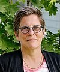
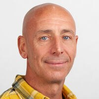
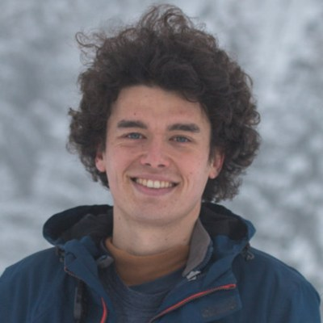
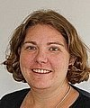
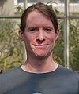
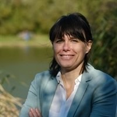
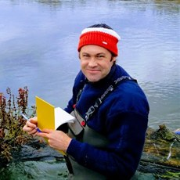
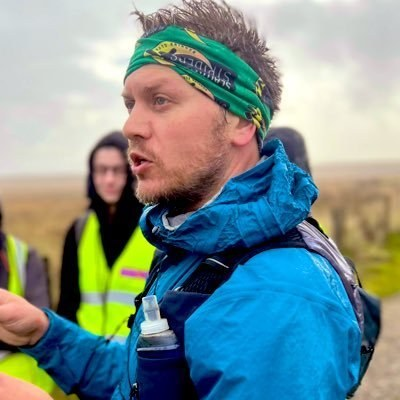

::: {#heading}
My postdoctoral research at the [Swiss Federal Institute for Forest, Snow and Landscape Research (WSL)](https://www.wsl.ch/) and [Eawag](https://www.eawag.ch/), the Swiss Federal Institute of Aquatic Science and Technology, within the project [**Species interactions in beaver-engineered habitats link land–water ecosystem processes**](https://www.wsl.ch/en/about-wsl/organisation/programmes-and-initiatives/completed-programmes-and-large-projects/blue-green-biodiversity-research-initiative/species-interactions-in-beaver-engineered-habitats-link-land-water-ecosystem-processes/) , funded by the **Blue-Green Biodiversity Research Initiative**, a joint Eawag–WSL programme on the interface between aquatic and terrestrial biodiversity. The project ran from 2021 to 2025; I joined it in 2023.
:::

## Project description

.](images/beaver_tinner.jpg){fig-align="center" width="85%"}

Beavers are the textbook ecosystem engineer. By felling trees and building dams they convert a fast, narrow, shaded stream into a mosaic of ponds, wetland and open canopy — and in doing so they redraw the boundary between the land and the water. Fallen wood and leaf litter enter the channel, water slows down and warms, light reaches the water surface, and the flooded margins turn terrestrial soil into aquatic habitat.

The project asked what that engineering does to the *interactions* between organisms on either side of that boundary, and what those altered interactions mean for how the ecosystem functions.

::: {.callout-important appearance="minimal" icon="false"}
## Open questions addressed:

-   Do beaver-engineered habitats support more diverse and more interconnected communities across the land–water boundary?

-   How do diversity and the strength of species interactions relate to local ecosystem processes — carbon cycling, nutrient cycling and water quality?

-   How effectively do beaver-engineered systems and their ecological networks buffer human impact?
:::

The design compares streams and their surrounding riparian areas **with and without beaver activity**, across beaver-engineered ecosystems spanning gradients from open farmland to closed forest and from low to high human pressure. Abundances and traits were recorded for interacting terrestrial and aquatic organisms — from bats and birds to macroinvertebrates, plankton and microbes — alongside direct measurements of ecosystem processes.

## My role

I was the postdoctoral researcher on the biogeochemical side of the project, affiliated with **WSL and Eawag**. My own work asks **to what extent, and when, beavers influence dissolved organic carbon (DOC) and nutrient concentrations in streams** — that is, whether a beaver-engineered reach acts as a source or a sink of carbon and nutrients, and which conditions decide which of the two it is. It uses a paired design: water is sampled immediately upstream and immediately downstream of each beaver-engineered reach, and the difference between the two is the outcome.

I also **co-advise the Ph.D. student [Valentin Moser](https://vamoser.ch/)** (WSL & Eawag) on the project, and contributed the statistical analysis to the biodiversity papers listed below.

::: {.callout-note appearance="simple"}
This study is **currently under review**. The description and figure below reflect the work as I presented it publicly; the results are not yet peer-reviewed.
:::

{fig-align="center" width="95%"}

Framing it as a difference rather than an absolute concentration matters: it removes the catchment the stream happens to drain, and isolates what the beaver does. The same paired logic applies to the nutrients.

The full account of this work, and the reference for everything described above, is the talk I gave at the **13th Workshop on Floodplain Ecology** at WSL on 14 March 2024: [*Beavers influence stream dissolved organic carbon by coupling terrestrial–aquatic ecosystems*](../../slides/2024-03_wsl_floodplain_workshop_beavers_doc.pdf) (PDF), also listed on my [Science Communication](../../science_communication.qmd) page.

## Research papers associated:

Moser, V., Minnig, S., **Capitani, L.**, Boch, S., Cramer, N., Edman, O., Hofmann, P., Hürbin, A., Obrist, M. K., Robinson, C., Tinner, D., Zehnder, L., Angst, C., Pomati, F., & Risch, A. C. (2026). Rewilding beyond the wilderness: Beavers can restore stream biodiversity from urban to agricultural to natural landscapes. *Journal of Applied Ecology, 63*(6), e70439. <https://doi.org/10.1111/1365-2664.70439>

Moser, V., **Capitani, L.**, Zehnder, L., Hürbin, A., Obrist, M. K., Ecker, K., Boch, S., Minnig, S., Angst, C., Pomati, F., & Risch, A. C. (2025). Habitat heterogeneity and food availability in beaver-engineered streams foster bat richness, activity and feeding. *Journal of Animal Ecology, 94*(12), 2403–2420. <https://doi.org/10.1111/1365-2656.70136>

## Project leaders

### Anita C. Risch {align="right" width="120" fig-alt="Portrait of Anita C. Risch"}

-   Project lead · group leader, Community Ecology
-   🏦 WSL, Switzerland
-   [🔗 Profile](https://www.wsl.ch/en/staff/risch/)

### Francesco Pomati {align="right" width="120" fig-alt="Portrait of Francesco Pomati"}

-   Project lead · group leader, Department of Aquatic Ecology
-   🏦 Eawag, Switzerland
-   [🔗 Profile](https://www.eawag.ch/en/about-us/portrait/organisation/staff/profile/francesco-pomati/show/)

## Core collaborators

### Valentin Moser {align="right" width="120" fig-alt="Portrait of Valentin Moser"}

-   Ph.D. student on the project, co-advised by me
-   🏦 WSL & Eawag, Switzerland
-   [🔗 Website](https://vamoser.ch/)

### Aline Frossard {align="right" width="120" fig-alt="Portrait of Aline Frossard"}

-   Soil microbial ecology
-   🏦 WSL, Switzerland
-   [🔗 Profile](https://www.wsl.ch/en/staff/frossard/)

### Steffen Boch {align="right" width="120" fig-alt="Portrait of Steffen Boch"}

-   Plant diversity
-   🏦 WSL, Switzerland
-   [🔗 Profile](https://www.wsl.ch/en/staff/boch/)

### Christof Angst

-   Beaver ecology and management · head of the national beaver office
-   🏦 info fauna – Nationale Biberfachstelle, Neuchâtel, Switzerland
-   [🔗 info fauna](https://www.infofauna.ch/)

### Annegret Larsen {align="right" width="120" fig-alt="Portrait of Annegret Larsen"}

-   Fluvial geomorphology and beaver-driven carbon storage
-   🏦 Wageningen University & Research, Netherlands
-   [🔗 Profile](https://research.wur.nl/en/persons/annegret-larsen/)

### Joshua R. Larsen {align="right" width="120" fig-alt="Portrait of Joshua R. Larsen"}

-   Hydrology, ecohydrology and biogeochemistry
-   🏦 University of Birmingham, United Kingdom
-   [🔗 Profile](https://www.birmingham.ac.uk/staff/profiles/gees/larsen-joshua)

### Matthew Dennis {align="right" width="120" fig-alt="Portrait of Matthew Dennis"}

-   Computational landscape ecology and species reintroductions
-   🏦 University of Manchester, United Kingdom
-   [🔗 Profile](https://research.manchester.ac.uk/en/persons/matthew.dennis/)

### Silvan Minnig

-   Environmental education and beaver field survey
-   🏦 [umweltbildner.ch](https://www.umweltbildner.ch/), Switzerland

### Dominic Tinner and Julia Holmes

-   M.Sc. students on the project
-   🏦 WSL, Switzerland
-   [🔗 Dominic Tinner](https://dominictinner.pro)
